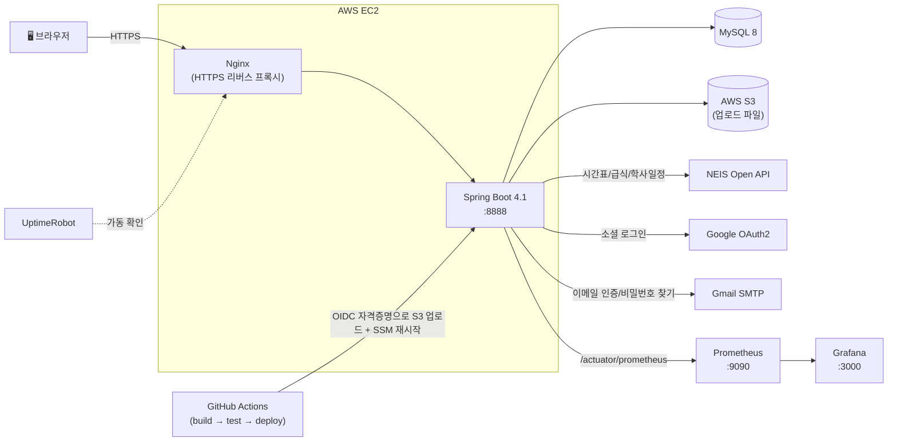
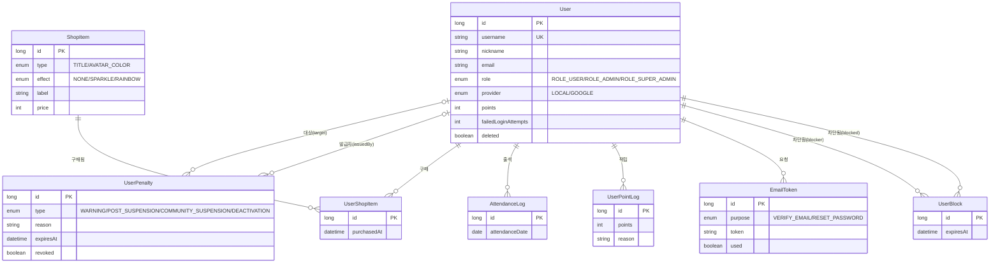
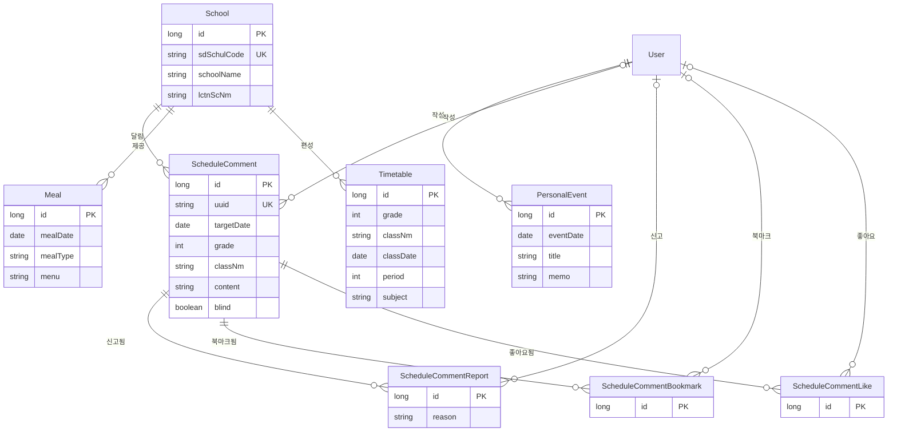
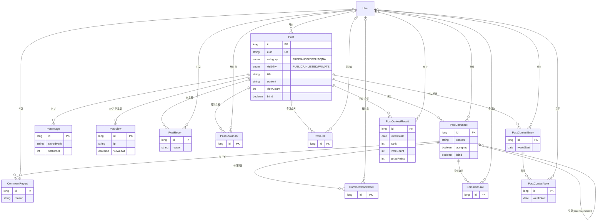
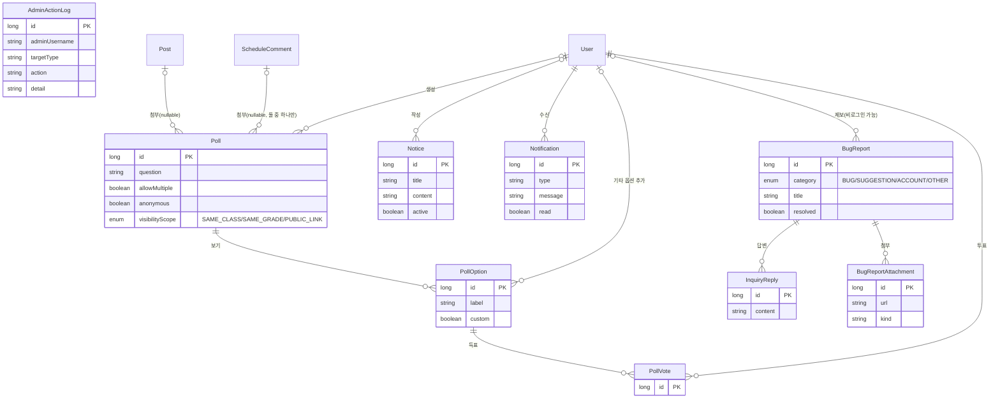

# 🏫 webproject

**학교일정을 확인하고, 같은 학교 학생들끼리 소통할 수 있는 커뮤니티 웹서비스**

[](https://webschool.kro.kr/)
[](https://github.com/jihu1130/webproject/actions/workflows/ci.yml)
[](https://openjdk.org/)
[](https://spring.io/projects/spring-boot)
[](https://spring.io/projects/spring-security)
[](https://hibernate.org/)
[](https://www.mysql.com/)
[](https://www.thymeleaf.org/)

---

🔗 **바로가기**: [https://webschool.kro.kr/](https://webschool.kro.kr/)
> 비용 절감을 위해 서버(AWS EC2)를 상시 켜두지 않습니다. 접속이 안 될 경우 잠시 후 다시
> 시도해주세요.

## 📌 소개

NEIS(교육정보 개방 포털) API로 시간표·급식·학사일정을 실시간으로 조회하고,
같은 학교 학생들끼리 커뮤니티에서 소통할 수 있는 학교 생활 플랫폼입니다.
동명 학교를 주소로 구분하는 학교 찾기부터, 자유/익명/QnA 게시판, 신고 기반
자동 블라인드, 날짜별 "오늘의 한마디", 게시글에 붙는 설문/투표, 포인트·티어
기반 상점, 주간 인기글 콘테스트, 권한이 세분화된 관리자 페이지까지 직접
설계하고 구현했으며, GitHub Actions로 AWS에 자동 배포되고 UptimeRobot로
가동 상태를 모니터링하고 있습니다.

이 README는 코드를 처음 받아서 로컬에 직접 띄워보려는 사람을 위한 가이드도
겸합니다 — 필요한 API 키 발급 방법까지 [시작하기](#-시작하기)에 정리해뒀습니다.

## ✨ 주요 기능

- 🔍 **학교 찾기** — 동명학교를 주소로 구분해서 검색
- 📅 **학교일정 연동(NEIS API)** — 시간표 · 급식 · 학사일정 조회, DB 캐시(24시간
  TTL). 캘린더 · 시간표/급식/학사일정 조회 · "오늘의 한마디" 목록은 **비로그인
  사용자도 열람 가능**(작성/좋아요/북마크/신고 등 쓰기 동작만 로그인 필요),
  학교/학년/반 선택 상태는 URL로 공유 가능
- 🗓️ **개인 일정** — 로그인 사용자가 캘린더에 직접 등록하는 날짜별 개인 메모/일정,
  월 그리드에 점으로 표시(본인에게만 보임)
- 🔐 **로그인/회원가입** — 로컬 계정 + 구글 소셜 로그인(OAuth2), 첫 로그인 시
  학교 설정·비밀번호 설정 강제 온보딩(구글 첫 가입은 본인도 모르는 임의
  비밀번호로 생성되므로), 5회 연속 실패 시 계정 잠금 + 남은 시도 횟수 안내
  (브루트포스 방지), 탈퇴 후에도 같은 구글 계정으로 재로그인하면 자동 복구
  (단, 관리자가 강제 탈퇴시킨 계정은 예외). 이메일 인증 · 아이디/비밀번호
  찾기(SMTP 발송) 지원
- 📆 **출석체크** — 마이페이지에서 매일 체크인, 연속 출석일수에 따라 포인트
  지급, 출석 현황 미니 캘린더
- 💬 **커뮤니티** — 자유 / 익명 / QnA 게시판, 댓글, 이미지 첨부, 리치 에디터
  (동영상/파일 임베드), 게시글 공개범위(전체공개/링크공개/비공개) 설정
- 🗳️ **설문/투표** — 게시글·오늘의 한마디에 붙는 설문, 다중 선택 및 기타 의견
  직접 입력 지원, 관리자 소프트 삭제
- 🏆 **인기 게시글 주간 콘테스트** — 본인 게시물 후보 신청, 득표 상위 3명에게
  매주 포인트 지급
- 🛍️ **포인트 · 티어 · 상점** — 활동으로 포인트를 모아 상점에서 칭호/아바타
  효과(반짝임/무지개 등) 구매, 상점 또는 마이페이지 프로필 설정에서 바로
  장착/해제, 포인트 랭킹(상위 10명 + 내 순위)·티어 안내 페이지 제공
- 🚨 **신고 → 자동 블라인드** — 게시글·댓글·한마디 공통으로, 서로 다른 사용자
  3명이 신고하면 자동 블라인드 처리, 금지어 필터 병행 적용
- 📝 **오늘의 한마디** — 날짜별 한 줄 댓글, 좋아요/북마크
- 🐛 **버그 제보 / 문의** — 비로그인 사용자도 첨부파일과 함께 제출 가능,
  관리자 답변(마이페이지 "내 문의"에서 1:1 문의 형태로 조회 + 알림)
- 🛡️ **관리자 페이지** — 총관리자/부관리자 2단계, 부관리자 권한을 기능별로
  개별 On/Off (신고 · 게시글 · 한마디 · 공지 · 설문 · 상점 · 문의 · 계정 관리)
- 🧾 **관리자 감사/보안/에러 로그** — 일반 활동 감사 로그와 별도로, 로그인 실패
  · 계정 잠금 · 권한 변경처럼 보안 관점에서 봐야 할 기록만 모은 보안 로그,
  최근 예외를 메모리에서 바로 확인하는 에러 로그 화면(총관리자 전용)
- 📊 **서버 상태 대시보드** — 동시 접속 세션 수 · CPU/힙 메모리 사용량 등을
  최근 추이 그래프로 확인(총관리자 전용), k6 부하테스트 결과도 같은 화면에서 조회
- 📢 **공지사항** — 활성 공지 항상 1개 유지, 과거 이력 보관 및 조회
- 🔔 **알림** — 댓글/좋아요/답글/관리자 조치/공지에 대한 알림(항목별 on-off),
  네비바 뱃지
- 🏖️ **방학 D-Day** — 학사일정 기반 방학까지 남은 일수 계산

## 🛠️ 기술 스택

| 영역 | 스택 |
|---|---|
| Language | Java 21 |
| Framework | Spring Boot 4.1.0 (Web MVC, Data JPA, Security, Thymeleaf, Actuator) |
| ORM / DB | Hibernate 7.4.1, MySQL 8 |
| Auth | Spring Security, OAuth2 Client (Google Login) |
| View | Thymeleaf, Bootstrap 5.3, FontAwesome, Pretendard, FullCalendar, Quill(리치 에디터) |
| External API | NEIS Open API (`java.net.http.HttpClient` 직접 연동) |
| Build | Gradle |
| Infra / CI·CD | AWS EC2 · S3(파일 저장) · SSM, GitHub Actions (OIDC 기반 배포), Docker Compose(로컬) |
| Monitoring | Prometheus · Grafana(지표), UptimeRobot(가동 확인), k6(부하 테스트) |

## 🗂️ 패키지 구조

기능(도메인) 단위로 패키지를 분리했습니다 — 레이어(controller/service 등)가
아니라 `user`, `school`, `post`처럼 도메인이 최상위 기준입니다. 각 도메인
안에서도 관리자 전용 화면(컨트롤러/서비스/DTO)은 `admin` 서브패키지로 한 번 더
분리되어 있고, 최상위 `admin` 패키지는 특정 기능에 속하지 않는 감사 로그와
관리자 홈 진입점만 담당합니다.

```
com.webschool.webschool
├── home         : 홈("/") · 통합검색 진입점
├── admin        : 관리자 홈("/admin", 권한별 첫 메뉴로 리다이렉트) + 관리자 행동 감사/보안/에러 로그
├── global       : 보안 설정, 정적 리소스 서빙, 권한 인터셉터, 공통 모델 어드바이스
├── user         : 회원가입/로그인, 마이페이지, 계정 관리, 프로필 조회 (관리자 계정 관리는 user/admin)
├── school       : 캘린더, NEIS 연동, 시간표/급식 캐시, 학사일정, 개인 일정, 오늘의 한마디 (관리자 화면은 school/admin)
├── post         : 커뮤니티(자유/익명/QnA) + 댓글 + 신고/블라인드 + 이미지 첨부 (관리자 화면은 post/admin)
├── poll         : 게시글/한마디에 붙는 설문·투표 (관리자 화면은 poll/admin)
├── notice       : 공지사항(활성 공지 1개 유지, 이력 보관) (관리자 화면은 notice/admin)
├── notification : 댓글/좋아요/관리자 조치/공지 알림
└── bugreport    : 버그 제보 · 1:1 문의 (관리자 답변 화면은 bugreport/admin)
```

## 🏗️ 아키텍처



- **배포**: nginx가 HTTPS를 종단하고 Spring Boot 앱(8888)으로 리버스 프록시,
  앱은 systemd 서비스(또는 Docker Compose)로 EC2에서 실행됩니다.
- **CI/CD**: `main` push → GitHub Actions가 MySQL 서비스 컨테이너 위에서
  빌드/테스트 → OIDC로 발급받은 임시 AWS 자격증명으로 jar를 S3에 업로드 →
  SSH 없이 SSM으로 EC2에 전달 및 재시작.
  자세한 내용은 [배포](#-배포) 참고.
  - **로컬 대안**: Docker Compose로 앱 + MySQL + Prometheus + Grafana를
    한 번에 띄울 수 있습니다([시작하기](#-시작하기) 참고).

## 🗄️ ERD (데이터베이스 구조)

38개 엔티티가 있어 도메인 패키지 단위로 4개 다이어그램으로 나눴습니다. 화살표는
전부 자식 → 부모 방향의 `@ManyToOne`(단방향, `@OneToMany` 컬렉션은 쓰지 않는
설계 원칙)이며, `User` FK는 대부분 nullable입니다 — 탈퇴 후 7일이 지나면
계정이 실제로 하드 삭제되는데(아래 [설계 원칙](#-설계-원칙) 참고) 작성자
FK만 끊고 콘텐츠는 남기기 위함입니다.

### 사용자 · 포인트 · 상점 (`user`)



### 학교 · 캘린더 (`school`)



### 커뮤니티 (`post`)



### 설문 · 공지 · 알림 · 문의 · 로그 (`poll` / `notice` / `notification` / `bugreport` / `admin`)



> `AdminActionLog`는 의도적으로 FK가 없습니다(감사 대상을 `targetType`/`targetId`
> 문자열·숫자 컬럼으로만 기록 — 대상이 이미 삭제된 뒤에도 로그가 남아있어야
> 하기 때문).

## 🚀 시작하기

### 요구사항

- Java 21 (JDK)
- MySQL 8 — 로컬에 직접 설치하거나, 아래 Docker Compose 방법으로 대체 가능
- Git

### 1) 클론

```bash
git clone https://github.com/jihu1130/webproject.git
cd webproject
```

### 2) API 키 발급

| 항목 | 필수 여부 | 발급처 | 비워두면 |
|---|---|---|---|
| NEIS Open API 인증키 | **필수** | [open.neis.go.kr](https://open.neis.go.kr/) | 앱 자체가 기동 실패 |
| Google OAuth Client ID/Secret | 선택 | [Google Cloud Console](https://console.cloud.google.com/apis/credentials) | "구글로 로그인" 버튼만 자동으로 숨겨짐 |
| Gmail 앱 비밀번호(SMTP) | 선택 | [Google 계정 - 앱 비밀번호](https://myaccount.google.com/apppasswords) | 이메일 인증/아이디·비밀번호 찾기만 비활성화 |

**NEIS Open API 인증키 (필수)**
1. [open.neis.go.kr](https://open.neis.go.kr/)에서 회원가입/로그인
2. 마이페이지에서 **인증키 신청** → Open API 활용신청에서 학교기본정보/시간표/
   급식/학사일정 서비스를 선택해 신청(승인은 보통 즉시 처리됩니다)
3. 발급된 키를 아래 3)단계의 `application.yml`의 `neis.api.key`에 입력

**Google OAuth (선택 — 소셜 로그인을 쓰려면)**
1. [Google Cloud Console](https://console.cloud.google.com/apis/credentials)에서
   프로젝트 생성 후 "OAuth 동의 화면" 구성(외부, 테스트 사용자 등록)
2. "사용자 인증 정보 만들기" → OAuth 클라이언트 ID(애플리케이션 유형: 웹 애플리케이션)
3. **승인된 리디렉션 URI**에 로컬 개발 기준 `http://localhost:8888/login/oauth2/code/google`을
   정확히 등록(운영 배포 시 실제 도메인의 https 버전도 별도로 추가) — 한 글자라도
   다르면 `redirect_uri_mismatch` 에러가 납니다
4. 발급된 Client ID/Secret을 `application.yml`의 `spring.security.oauth2` 블록에 입력

**Gmail 앱 비밀번호 (선택 — 이메일 인증/아이디·비밀번호 찾기를 쓰려면)**
1. 구글 계정에 2단계 인증이 먼저 켜져 있어야 합니다
2. [myaccount.google.com/apppasswords](https://myaccount.google.com/apppasswords)에서
   앱 비밀번호를 새로 생성
3. 생성된 16자리 비밀번호를 `application.yml`의 `spring.mail.password`에 입력
   (평소 로그인 비밀번호가 아닙니다)

### 3) application.yml 준비

```bash
cp src/main/resources/application.yml.example src/main/resources/application.yml
```

위에서 발급받은 값들과 로컬 MySQL 비밀번호를 채워 넣습니다. 구글 로그인/SMTP
블록은 선택 사항이라 비워두면 그 기능만 조용히 꺼진 채 앱은 정상 기동합니다.

### 4) 실행

**방법 A — 로컬 MySQL**

```bash
# MySQL에 webschool 데이터베이스를 미리 만들어둔 뒤
./gradlew bootRun   # http://localhost:8888
```

**방법 B — Docker Compose (MySQL을 직접 설치하고 싶지 않다면)**

```bash
cp .env.example .env
# MYSQL_ROOT_PASSWORD / NEIS_API_KEY 입력
docker compose up --build   # http://localhost:8888
```

같은 `docker compose up`으로 애플리케이션 지표(요청 처리량/응답시간/JVM 등) 모니터링용
Prometheus([http://localhost:9090](http://localhost:9090))와
Grafana([http://localhost:3000](http://localhost:3000), 계정 `admin`/`admin`, Prometheus
데이터소스 자동 연결됨)도 함께 뜹니다.

### 5) 테스트 데이터 심기 (선택)

빈 DB로 시작하면 둘러볼 데이터가 없으니, 아래 시더로 예시 계정/게시글을 채울 수 있습니다.

```bash
./gradlew test --tests "com.webschool.webschool.TestDataSeeder"
./gradlew test --tests "com.webschool.webschool.SuperAdminSeeder"
```

`test1`~`test5`(아이디=비밀번호) 일반 계정과 예시 게시글/한마디, `admin`/`admin`
총관리자 계정이 생성됩니다. 이미 존재하는 데이터는 건너뛰므로 여러 번 실행해도
안전합니다. **배포 전에는 반드시 비밀번호를 바꾸세요.**

## 🌐 배포

- **서비스 주소**: [https://webschool.kro.kr/](https://webschool.kro.kr/)
- `main` 브랜치에 push되면 GitHub Actions가 빌드 → 테스트 → 배포를 자동으로 수행합니다.
  - **Build/Test**: MySQL 8 서비스 컨테이너 위에서 `./gradlew build`
  - **Deploy**: OIDC로 발급받은 임시 AWS 자격증명으로 jar를 S3에 업로드하고, SSH 없이
    SSM(`AWS-RunShellScript`)으로 EC2 인스턴스에 전달·재시작
  - **Health check**: 재배포 후 `/actuator/health`가 200을 반환할 때까지 확인
- 비용 절감을 위해 EC2 인스턴스를 상시 가동하지 않습니다. 인스턴스가 꺼져 있을 때
  push되면 배포 단계는 실패 대신 건너뛰도록 처리되어 있습니다.

## 🔒 권한 체계

| 역할 | 설명 |
|---|---|
| `ROLE_USER` | 일반 사용자 |
| `ROLE_ADMIN` | 부관리자 — 신고/게시글/한마디/공지/설문/상점/문의/계정 관리 권한을 7개 항목으로 세분화해서 개별 부여 |
| `ROLE_SUPER_ADMIN` | 총관리자 — 여러 명 지정 가능, 부관리자 권한 승격/회수, 감사·보안·에러 로그 열람, 서버 상태 대시보드 조회 |

## 🧩 설계 원칙

- 삭제는 전부 **소프트 딜리트** (물리 삭제로 인한 FK 오류 방지). 단, `User`는
  예외 — 본인 탈퇴 후 7일이 지나면 계정 행 자체가 실제로 하드 삭제되고,
  작성했던 게시글/댓글은 그대로 남되 작성자만 "탈퇴한 사용자"로 표시됩니다
  (관리자가 강제 탈퇴시킨 계정은 이 배치 대상에서 제외)
- 신고 → 자동 블라인드 패턴을 게시글/댓글/한마디에 동일하게 적용
- 익명 게시글은 서버 단에서 닉네임을 치환하고, 프로필/검색에서 제외해 익명성 보장
- 탈퇴 계정은 일반 화면에서만 닉네임을 치환(관리자 화면은 실제 신원 유지)
- 로컬/구글 계정은 완전히 별개로 취급(이메일이 같아도 자동 연동하지 않음),
  구글 계정 탈퇴는 같은 계정 재로그인 시 자기 복구되지만 관리자가 강제
  탈퇴시킨 경우는 예외
- 업로드 파일은 위험 확장자(실행 파일, 스크립트 삽입 가능한 SVG 등) 차단

---

<p align="center">Made with ☕ by <a href="https://github.com/jihu1130">jihu1130</a></p>
